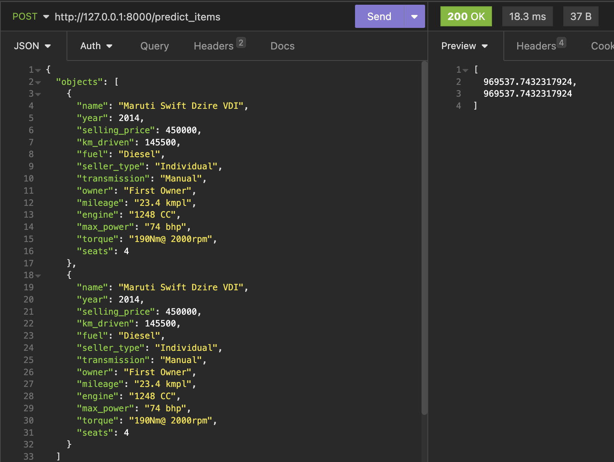
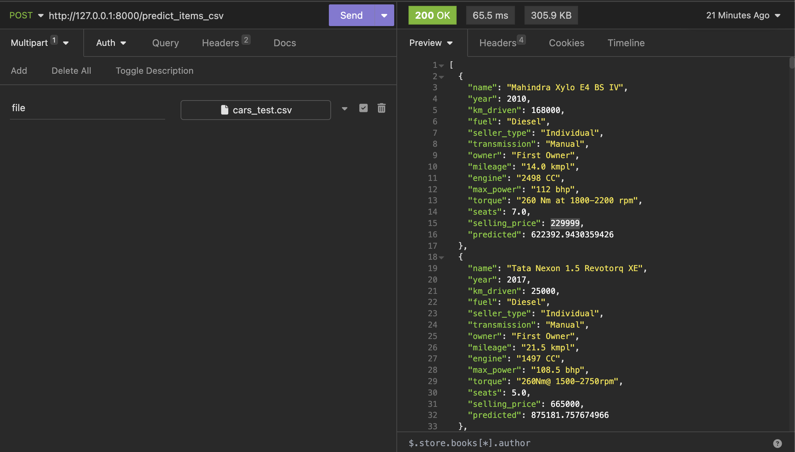

# Домашнее задание 1

Выполнил: Дубровец Виталий Олегович

## Что было сделано
  - EDA
  - Визуализация
  - Скейлинг
  - Перебор гиперпараметров
  - Кодирование категориальных фич
  - Бизнес-метрика
  - Реализован сервис на FastAPI
- Результаты лучшей модели
  - R2: 0.066985776178356 
  - MSE: 216447243009.5205
  - Бизнес-метрика: 0.251 
## Что дало наибольший буст
  - Кодирование категориальных фич, OneHot
  - MSE
    - Было: 232245173036.16904
    - Стало: 216447243009.5205
  - R2
    - Было: -0.13189959480728386
    - Стало: 0.066985776178356 
## Что не вышло
  - Добиться адекватного MSE
  - Добиться высокой бизнес-метрики
## Работа сервиса

Предсказание для нескольких json-объектов

Предсказание для csv-файла\
(добавляется столбец `predicted`)\
Для тестов использовался файл `cars_test.csv`

